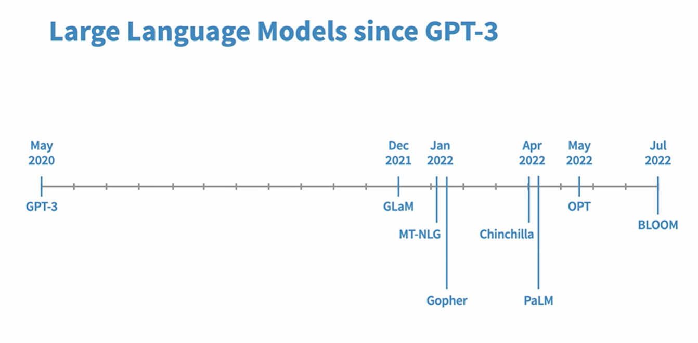
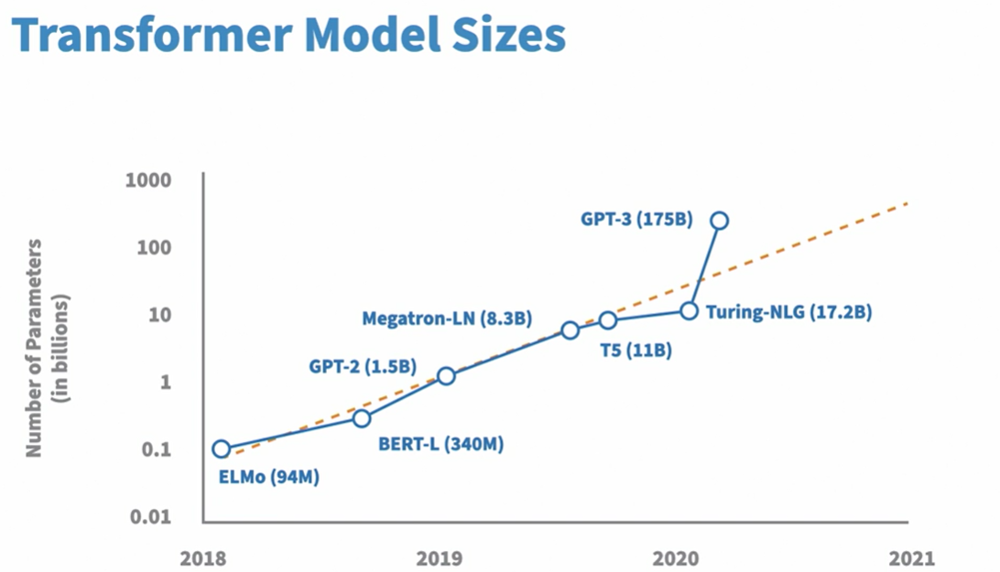

# Large language models 

## BERT LLM model 
Google search using BERT LLM to convert our searches to more meaningful search. 

## Transformer
- GPT - generative pre trained model developed by Open AI. 
- GPT 3 - improved the quality of english. 

## Transfer learning : 
This is process of repeated training of models. Initially model training happens to get the pretrained model. With this, we first achieve good understanding of language. 
On top of this pretrained model, again fine tuning happens to get the text classification, named entity recognition and questions answering. 

Sentimental analysis 

BERT is trained with the data source - novels and wikipedia. 
Infrastructure required here is massive. 
 
 Benefits 
    faster development
    less data to fine tune. 
    good results. 

## Transformer architecture 
It has a encoder and decoder. 

 encoder and decoder model. - used for transformation, conversion. 
 decoder model - classification. 
 self attention mechanism - helps to understand the context, 
  - function (Query, Key and value)

  A self-attention mechanism works by comparing every word in the sentence to every other word in the sentence. It incorporates embeddings for all other words in the sentence and then uses a weighted average of the embeddings of other context words.

  In a multi-head attention mechanism, the relationships are formed within each attention head and learned from the data.

  ## Prompt
  * zero shot learning - with no examples
  * 1 shot learning - with examples. 
  * few shot learning - with couple of examples. 

  ## GPT Usecases 
  Chat gpt playground. 
  with examples 

  ## Shortcomings of GPT 3 
  - Bias based on the training data. 
  - gender bias
    doctor - male, nurse - female, receptionist : female. 
  - GPT3 -more carbon emission 

    Data source - reddit, book1, wikipedia.. 

    ## GLaM model 
    
    

