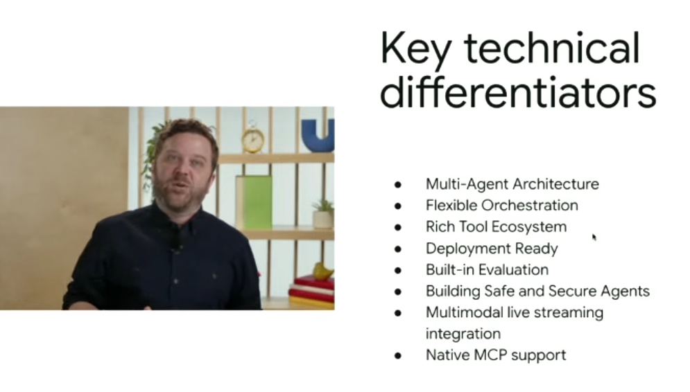
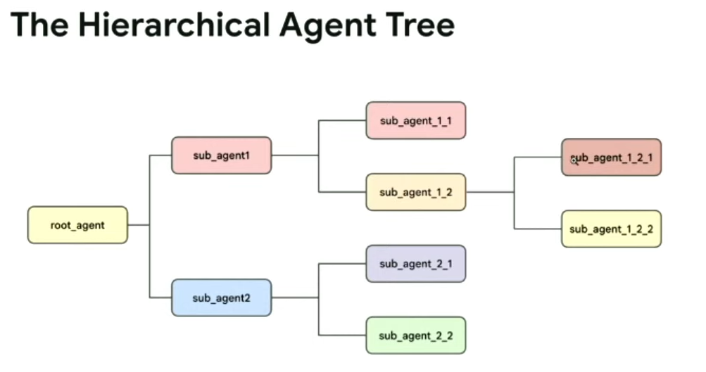
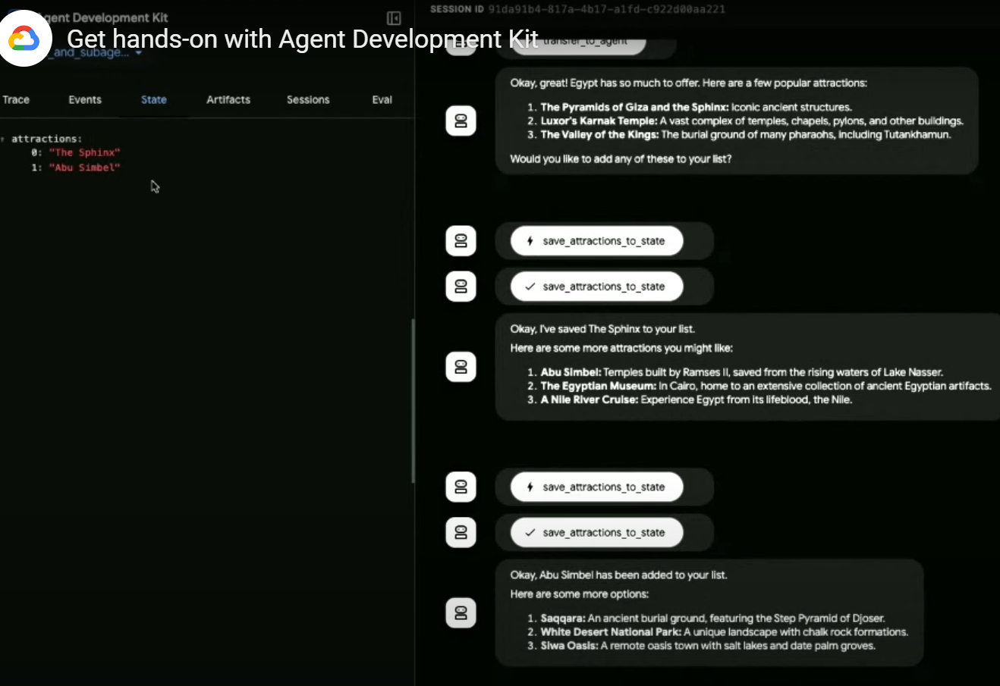

# Agent Development Kit

1. Agent development kit
2. Model contect protocol. 
3. vertex ai engine
4. a2a protocol - agent 2 agent communication. 

## Agent development kit

tech details 
1. instruction to define goal

ADK Documentation - goo.gle/adk

Lab : https://explore.qwiklabs.com/classrooms/17723/labs/101686

Devui us used to communicate to Agent Engine. 

Transferring control to the sub agents. 

templating in the instructions - {{ attractions? }}

Multi agent examples - 
1 agent writes the code. 
2nd agent will review and fix the issues and refactors. 

Review Get started with Agent development toolkit.
max_iterations 

Home work : Agent which creates movie footage with Vio. 
Repeatable tasks can be handed of to agents. 

Recordings : 
https://cloudonair.withgoogle.com/events/get-hands-on-with-agent-dev-kit/watch?talk=t1-s1

How to get into the Qwiklab classroom:
Go to the Qwiklabs URL:  explore.qwiklabs.com
Sign in with existing account or join with  
the email you used to register for the event.
Click on the box titled: 
“Get hands-on with Agent Development Kit” or click this link: https://explore.qwiklabs.com/ilt/classrooms/17723/focuses/101686 
Once the box is clicked, it will take you to the classroom to start the lab.
Use an incognito window to log into the Cloud Console to do the lab.

