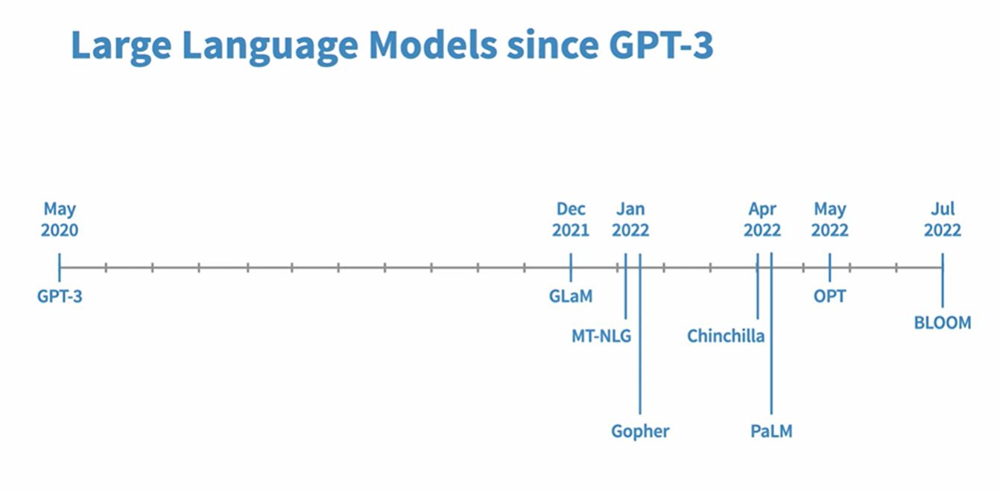
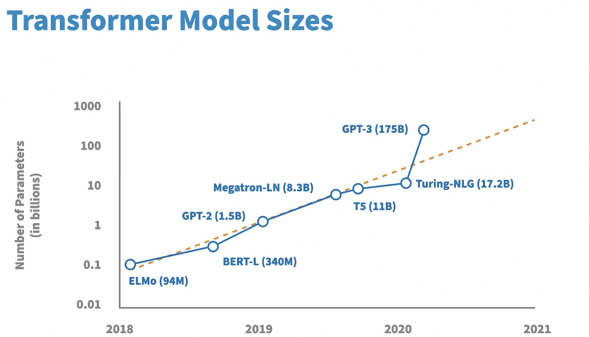

# agent.adk

## overview
- Agent Development Kit (ADK) provides a framework for building goal-driven agents.
- Key components:
  - **Model Context Protocol**: Used to define and structure the model's behavior.
  - **Vertex AI Engine**: Executes agent tasks.
  - **A2A Protocol**: Enables communication between agents (Agent-to-Agent).

## architecture
- ADK enables defining clear instructions to achieve goals.
- DevUI serves as the interface to communicate with the Agent Engine.

## documentation
- ADK Docs: [https://goo.gle/adk](https://goo.gle/adk)
- Lab Access: [Qwiklabs - Agent Dev Kit Lab](https://explore.qwiklabs.com/classrooms/17723/labs/101686)

## features

### templating
- ADK supports template-based instructions using syntax like: {{ attractions? }}

### multi-agent collaboration
- Agent 1: Writes the code.
- Agent 2: Reviews, fixes bugs, and refactors.

## Sub-Agent ControlTransfer

### repeatable tasks
- Tasks that are predictable or repeatable can be handed off to agents.
- Example homework:
- Build an agent that generates movie footage using Vio.

## usage notes

### getting started
- Review the "Get started with Agent Development Toolkit".
- Understand parameters like `max_iterations`.

### qwiklabs access
1. Visit: [https://explore.qwiklabs.com](https://explore.qwiklabs.com)
2. Sign in with your registered email.
3. Click on the classroom:
 - “Get hands-on with Agent Development Kit”
 - Or use this direct link: [Classroom Access](https://explore.qwiklabs.com/ilt/classrooms/17723/focuses/101686)
4. Open Cloud Console in incognito for lab tasks.

## recordings
- Event Replay: [Cloud OnAir Recording](https://cloudonair.withgoogle.com/events/get-hands-on-with-agent-dev-kit/watch?talk=t1-s1)
